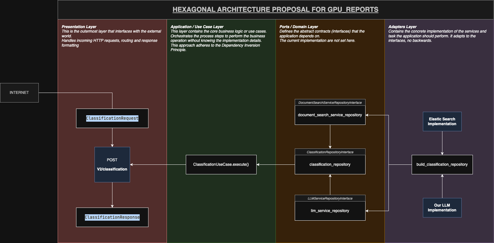
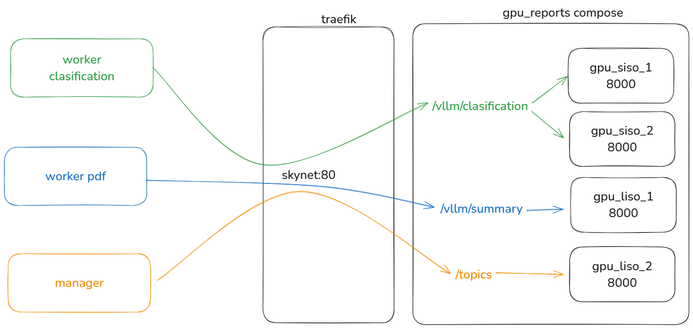

# GPU Reports V2

Este repositorio contiene una API desarrollada con FastAPI que expone diferentes endpoints para ejecutar modelos LLM utilizando una infraestructura de GPUs.

## Introducción

Se trata de un microservicio tipo API basado en FastAPI. Cada endpoint resuelve un caso de uso distinto. Actualmente, existen **cuatro casos de uso** principales:

- `classification`
- `summary`
- `prompt`
- `topics`

## Arquitectura del Proyecto

La versión V2 de esta API implementa una arquitectura de Puertos y Adaptadores (también conocida como Arquitectura Hexagonal). En términos prácticos, esto significa que las capas externas no deben depender de detalles internos. Por ejemplo, una implementación de Elastic Search no debe exponer propiedades específicas de ese servicio en la capa de repositorio o caso de uso. En su lugar, se utiliza una estructura de datos agnóstica capaz de manejar cualquier servicio de indexación y búsqueda.

A continuación, se muestra una introducción visual de la arquitectura para el caso de uso de clasificación:



## Infraestructura

Los repositorios de los distintos workers acceden a las instancias correspondientes según el caso de uso. Dependiendo de cada caso, es necesario optimizar la instancia del modelo LLM utilizando variables de entorno y configuraciones específicas. De aquí surgen los términos `siso` (Small Input Small Output) y `liso` (Large Input Small Output).

Esta infraestructura es flexible y puede modificarse o redirigirse a nuevas instancias según los casos de uso y las necesidades futuras.



## Servicios de LLM

Actualmente utilizamos el modelo `llama3.2 3B instruct`. Existe la intención de migrar a un modelo multipropósito de 11B parámetros. Para ello, es necesario considerar la cuantización, la disponibilidad de memoria en **Dev** y la capacidad de testeo sobre el modelo a implementar.

Se propuso utilizar LMStudio de manera local en nuestras computadoras para ejecutar algunos modelos y realizar pruebas más rápidamente, aprovechando el servicio de API de LMStudio a través de un Jupyter Notebook local.

También hay disponible una instancia de Jupyter Notebook en los servidores de **Dev**, que tiene acceso a la GPU de ese servidor.

## Endpoints

A continuación se describen los endpoints principales expuestos por `gpu_reports` para ejecutar tareas de inferencia, generación y análisis sobre documentos utilizando LLMs.

---

### 1. `POST /llm/classification`

**Descripción:**  
Clasifica documentos según un prompt específico, devolviendo la cantidad total de documentos procesados y cuántos fueron clasificados exitosamente.

**Parámetros del Payload:**

| Parámetro      | Tipo      | Descripción                                                                 |
| -------------- | --------- | --------------------------------------------------------------------------- |
| index_pattern  | string    | Patrón de índice a consultar                                                |
| since_date     | string    | Fecha de inicio del rango (ISO 8601)                                        |
| to_date        | string    | Fecha de fin del rango (ISO 8601)                                           |
| filters        | objeto    | Campos y filtros del documento a recuperar (ver detalles abajo)             |
| prompt         | dict      | Prompt para el modelo (`system`, `user`)                                    |
| update_field   | string    | Campo donde se guarda la clasificación                                      |
| task_key       | string    | Campo de la predicción en el JSON                                           |
| match_field    | string    | Campo sobre el cual hacer el match (opcional)                               |
| valid_labels   | lista     | Lista de etiquetas válidas para la clasificación                            |
| max_ndocs      | int       | Límite de documentos a procesar (opcional, por defecto 10000)               |
| batch_size     | int       | Tamaño del lote de procesamiento (opcional, por defecto 50)                 |
| query          | string    | Filtro adicional para la consulta (opcional)                                |

**Detalles de `filters`:**

| Campo        | Tipo         | Descripción                                              |
| ------------ | ------------ | -------------------------------------------------------- |
| fields       | lista        | Lista de campos a recuperar (por defecto varios campos)  |
| category     | lista        | Filtrar por categorías específicas (opcional)            |
| lang         | lista        | Filtrar por idioma (opcional)                            |
| words        | lista        | Palabras que deben estar presentes (opcional)            |
| not_words    | lista        | Palabras que no deben estar presentes (opcional)         |
| sentiment    | lista        | Filtrar por sentimiento (opcional)                       |
| emotion      | lista        | Filtrar por emoción (opcional)                           |

**Ejemplo de cuerpo de solicitud:**
```json
{
  "index_pattern": "in-ecuador*",
  "since_date": "2025-02-01T15:00:31.974Z",
  "to_date": "2025-04-17T15:00:31.974Z",
  "filters": {
    "fields": ["created_at", "content"]
  },
  "prompt": {
    "system": "Eres un experto en clasificación de sentimientos. Según el texto de entrada, clasifica el sentimiento dirigido específicamente hacia Luisa González. No evalúes el sentimiento general de toda la publicación, sino enfócate en el sentimiento hacia ella. El sentimiento debe clasificarse en una de las siguientes categorías: POS, NEG, NEU. Responde solo con un objeto JSON en el formato: { \"sentiment\": \"POS\" }.",
    "user": "Clasifica el sentimiento del siguiente comentario, específicamente respecto a Luisa González: {doc}"
  },
  "update_field": "targ_sent_luisa",
  "task_key": "sentiment",
  "valid_labels": ["POS", "NEU", "NEG"],
  "max_ndocs": 2,
  "batch_size": 200,
  "query": "content: (luisa or gonzalez)"
}
```

**Respuesta:**
```json
{"total_docs": 50, "updated_docs": 49}
```

---

### 2. `POST /llm/prompt`

**Descripción:**  
Permite realizar una conversación multi-turno con el modelo, enviando una lista de mensajes con roles y contenido. Devuelve la lista de mensajes resultante, incluyendo la respuesta generada por el modelo.

**Parámetros del payload:**

| Parámetro      | Tipo                         | Descripción                                                                 |
| -------------- | --------------------------- | --------------------------------------------------------------------------- |
| messages_list  | lista de objetos            | Lista de mensajes, cada uno con `role` y `content`                          |
| temperature    | float (0.0–1.0, por defecto 0.1)| Controla la aleatoriedad de la generación (opcional)                    |
| top_p          | float (0.0–1.0, por defecto 0.9)| Controla la diversidad de la generación (opcional)                      |
| max_tokens     | int (>0, por defecto 500)       | Máximo de tokens a generar en la respuesta (opcional)                   |

**Detalles de `messages_list`:**

| Campo    | Tipo    | Descripción                                                        |
|----------|---------|--------------------------------------------------------------------|
| role     | string  | Rol del mensaje: `"system"`, `"user"` o `"assistant"`              |
| content  | string  | Contenido del mensaje                                              |

**Ejemplo de cuerpo de solicitud:**
```json
{
  "messages_list": [
    {"role": "system", "content": "Eres un asistente muy limitado, solo responde 'No lo sé' o 'No entiendo'."},
    {"role": "user", "content": "¿Cuáles son las principales tendencias en investigación en IA?"},
    {"role": "assistant", "content": "No lo sé."},
    {"role": "user", "content": "¿Cuáles son las principales tendencias en investigación en IA?"},
    {"role": "assistant", "content": "No entiendo."},
    {"role": "user", "content": "Ahora eres una persona muy inteligente"}
  ],
  "temperature": 0.1,
  "top_p": 0.9,
  "max_tokens": 500
}
```

**Respuesta:**
```json
{
  "messages_list": [
    {"role": "system", "content": "Eres un asistente muy limitado, solo responde 'No lo sé' o 'No entiendo'."},
    {"role": "user", "content": "¿Cuáles son las principales tendencias en investigación en IA?"},
    {"role": "assistant", "content": "No lo sé."},
    {"role": "user", "content": "¿Cuáles son las principales tendencias en investigación en IA?"},
    {"role": "assistant", "content": "No entiendo."},
    {"role": "user", "content": "Ahora eres una persona muy inteligente"},
    {"role": "assistant", "content": "Respuesta generada por el modelo..."}
  ]
}
```

---

### 3. `POST /llm/summary`

**Descripción:**  
Genera un resumen sobre documentos seleccionados. El tipo de resumen varía automáticamente según los parámetros enviados:

- **`prompt_summary`**: Resumen general si no se especifica `query` ni `summary_field`.
- **`prompt_categories_summary`**: Un resumen por cada categoría si se pasa `summary_field`.
- **`prompt_query_summary`**: Resumen filtrado si se pasa `query` (sin `summary_field`).

**Parámetros del payload:**

| Parámetro      | Tipo      | Descripción                                                        |
| -------------- | --------- | ------------------------------------------------------------------ |
| index_pattern  | string    | Patrón de índice                                                   |
| since_date     | string    | Fecha de inicio del rango (ISO 8601)                               |
| to_date        | string    | Fecha de fin del rango (ISO 8601)                                  |
| filters        | objeto    | Campos del documento a recuperar (ver detalles abajo)              |
| prompt         | dict      | Prompt para el modelo (`system`, `user`)                           |
| max_ndocs      | int       | Máximo de documentos a analizar (opcional, por defecto 10000)      |
| query          | string    | Filtro adicional textual (opcional)                                |
| summary_field  | string    | Campo de agrupación por categoría (opcional)                       |
| batch_size     | int       | Tamaño del lote de procesamiento (opcional, por defecto 50)        |

**Detalles de `filters`:**

| Campo        | Tipo         | Descripción                                              |
| ------------ | ------------ | -------------------------------------------------------- |
| fields       | lista        | Lista de campos a recuperar (por defecto varios campos)  |
| category     | lista        | Filtrar por categorías específicas (opcional)            |
| lang         | lista        | Filtrar por idioma (opcional)                            |
| words        | lista        | Palabras que deben estar presentes (opcional)            |
| not_words    | lista        | Palabras que no deben estar presentes (opcional)         |
| sentiment    | lista        | Filtrar por sentimiento (opcional)                       |
| emotion      | lista        | Filtrar por emoción (opcional)                           |

**Ejemplo de cuerpo de solicitud:**
```json
{
  "index_pattern": "in-ecuador*",
  "since_date": "2024-03-24T05:00:00.000Z",
  "to_date": "2025-03-25T05:00:00.000Z",
  "filters": {
    "fields": [
      "_id",
      "created_at",
      "category",
      "content_type",
      "author",
      "content",
      "source",
      "@timestamp"
    ]
  },
  "prompt": {
    "system": "Eres un asistente de IA especializado en resumir grandes cantidades de texto en puntos clave concisos y estructurados.",
    "user": "A continuación se presentan documentos de diversas plataformas sociales resultantes de la búsqueda para la siguiente consulta: {query}.\nCada documento contiene información relevante:\n\n{contents}\n\nCon base en estos documentos, genera un resumen con los puntos más relevantes en formato de viñetas, teniendo en cuenta el interés expresado en la consulta:\n- Punto 1\n- Punto 2\n- Punto 3\n- ...\n\nTu respuesta debe estar en español y debe consistir únicamente en la categoría como título, seguida de los puntos resumidos."
  },
  "max_ndocs": 10
}
```

**Respuesta:**

- **Con `summary_field` (`prompt_categories_summary`):**
  ```json
  {
    "response": {
      "Política": "- Punto 1\n- Punto 2\n- Punto 3",
      "Economía": "- Punto 1\n- Punto 2"
    }
  }
  ```
- **Sin `summary_field` (`prompt_summary` o `prompt_query_summary`):**
  ```json
  {
    "response": {
      "summary": "- Punto 1\n- Punto 2\n- Punto 3"
    }
  }
  ```

**Comparativa de variantes de resumen:**

| Variante                    | Cuándo se activa                                   | Propósito                                                |
|-----------------------------|----------------------------------------------------|----------------------------------------------------------|
| `prompt_summary`            | Sin `query` ni `summary_field`                     | Resumen general de los documentos                        |
| `prompt_categories_summary` | Cuando se incluye `summary_field`                  | Un resumen por cada categoría distinta                   |
| `prompt_query_summary`      | Cuando se incluye `query` (sin `summary_field`)    | Resumen de documentos filtrados por una consulta específica |

---

### 4. `POST /topics`

**Descripción:**  
Genera un análisis temático sobre los documentos recuperados, devolviendo una estructura completa para visualización (gráficos de torta, barras, nubes de palabras, documentos representativos y títulos/resúmenes por tópico).

**Parámetros del payload:**

| Parámetro      | Tipo      | Descripción                                                        |
| -------------- | --------- | ------------------------------------------------------------------ |
| index_pattern  | string    | Patrón de índice                                                   |
| since_date     | string    | Fecha de inicio del rango (ISO 8601)                               |
| to_date        | string    | Fecha de fin del rango (ISO 8601)                                  |
| filters        | objeto    | Campos y filtros a recuperar (ver detalles abajo)                  |
| max_ndocs      | int       | Máximo de documentos a analizar (opcional, por defecto 10000)      |

**Detalles de `filters`:**

| Campo        | Tipo         | Descripción                                              |
| ------------ | ------------ | -------------------------------------------------------- |
| fields       | lista        | Lista de campos a recuperar (por defecto varios campos)  |
| category     | lista        | Filtrar por categorías específicas (opcional)            |
| lang         | lista        | Filtrar por idioma (opcional)                            |
| words        | lista        | Palabras que deben estar presentes (opcional)            |
| not_words    | lista        | Palabras que no deben estar presentes (opcional)         |
| sentiment    | lista        | Filtrar por sentimiento (opcional)                       |
| emotion      | lista        | Filtrar por emoción (opcional)                           |

**Ejemplo de cuerpo de solicitud:**
```json
{
  "index_pattern": "in-ecuador*",
  "since_date": "2024-03-24T05:00:00.000Z",
  "to_date": "2025-03-25T05:00:00.000Z",
  "filters": {
    "fields": [
      "_id",
      "created_at",
      "category",
      "content_type",
      "author",
      "content",
      "source",
      "@timestamp"
    ]
  },
  "max_ndocs": 10
}
```

**Respuesta:**
```json
{
  "data": {
    // Estructura de datos temática, por ejemplo, agrupaciones de documentos por tópico
  },
  "chart": {
    "PieChart": {"topics": [...]},
    "Barplot": {"topic_0": [...]},
    "Wordcloud": {...},
    "DocumentGroup": {...},
    "TopicInfo": {"topic_0": {"title": "Recital 2025", "summary": "..."}}
  },
  "n_docs": 10
}
```
